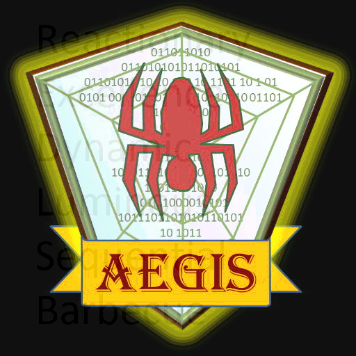
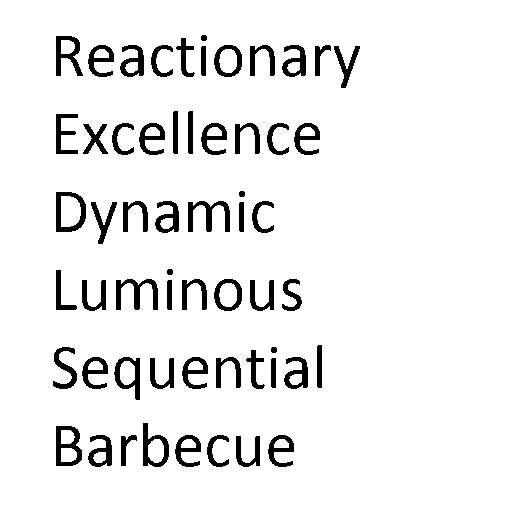

# 2018 神盾盃 Writeup

## Secret Doc 100

[secret.doc](secret.doc)

### Analysis
After we open the document, here is a piece of code and encoded string.
```
public class question {

	public static void main(String[] args) throws UnsupportedEncodingException, NoSuchAlgorithmException {
		// TODO Auto-generated method stub
		String flag="xxxxxxxxxxxxx3xxxxfxxx4xxxxxx7xxxxxxxxxx";

		
	}
	
	

		public static String encode(String text) throws UnsupportedEncodingException{
		
			byte[] bytearray= new byte[text.length()*2];			
			
		    for(int i=0;i<text.length();i++){	   
		    char c=text.charAt(i);	
		
			bytearray[2*i]=(byte) c;
			bytearray[2*i+1]=(byte) 53;	
		    
		    }
			final Base64.Encoder encoder=Base64.getEncoder();			
		    final String encodetext=encoder.encodeToString(bytearray);

			return encodetext;
		        
		        
		}
}


加密後的字串：
QTVFNUc1STVTNQ==
ZTUzNTg1ZDU3NQ==
ezUxNTg1NDVkNQ==
MzVhNTQ1ODVlNQ==
ZDVmNWI1MzU0NQ==
NzUyNTc1NjV9NQ==
MTUyNTY1ZjVjNQ==
MDU0NTQ1ZTU4NQ==
```

### Solving
1. write a script to decrypt all the encoded base64 string
```
import base64

flags = ['QTVFNUc1STVTNQ==',
'ZTUzNTg1ZDU3NQ==',
'ezUxNTg1NDVkNQ==',
'MzVhNTQ1ODVlNQ==',
'ZDVmNWI1MzU0NQ==',
'NzUyNTc1NjV9NQ==',
'MTUyNTY1ZjVjNQ==',
'MDU0NTQ1ZTU4NQ==']

print(''.join([base64.b64decode(x).decode("utf-8")  for x in flags]))
```
output: 'A5E5G5I5S5e53585d575{5158545d535a54585e5d5f5b5354575257565}5152565f5c5054545e585'


2. The output string format is unlike the official flag. According to the format, we try to aling the order 
```
for i in range(len(flag)):
    if i%2 == 0: f += flag[i]
    
'AEGISe38d7{184d3a48edfb347276}126fc044e8'
```

Alignment the flag
```
format: xxxxxxxxxxxxx3xxxxfxxx4xxxxxx7xxxxxxxxxx
  flag: AEGISe38d7{184d3a48edfb347276}126fc044e8

format: xxxxxxxxxxxxx3xxxxfxxx4xxxxxx7xxxxxxxxxx
  flag: AEGIS{184de38d73a48edfb34126fc044e87276}

format: xxxxxxxxxxxxx3xxxxfxxx4xxxxxx7xxxxxxxxxx
  flag: AEGIS{184d3a48edfb34126fce38d7044e87276}

format: xxxxxxxxxxxxx3xxxxfxxx4xxxxxx7xxxxxxxxxx
  flag: AEGIS{184ddfb34126fc3a48ee38d7044e87276} 
```

3. flag is AEGIS{184ddfb34126fc3a48ee38d7044e87276} 

### Comment
string alignment game

-------

## Misc 300


### Analysis
Seems steg challenge

### Solving
```
strings Qha6rLLCiaa8.png| grep -i aegis
```
none...

Try zsteg
```
~/nihwk/aegis zsteg Qha6rLLCiaa8.png
b1,r,msb,xy         .. text: "-8x5|:7[V-"
b1,g,lsb,xy         .. text: "}]i?w}0?4O:"
b1,b,msb,xy         .. text: "SLW1U1>QVW4u"
b1,rgb,msb,xy       .. text: "AEGIS{GZBwsh8GAa5FqJPE6E5BuA9pmATUrbLu9UfKrygEpu2etgSTQgJFSw9GaVKsQnYgPKGWkDWFfzWAHd6Er9EKTEbLUZtVpxxBWT}"
b2,b,msb,xy         .. text: "z>8^&Jr;"
b2,rgb,lsb,xy       .. text: "\nFY.|,\\n"
b2,rgb,msb,xy       .. text: "6\"qiNcpr"
```

flag is AEGIS{GZBwsh8GAa5FqJPE6E5BuA9pmATUrbLu9UfKrygEpu2etgSTQgJFSw9GaVKsQnYgPKGWkDWFfzWAHd6Er9EKTEbLUZtVpxxBWT}

### Comment
Easy as pie......

---

## Steg 200



### Analysis
1. Use Alpha value we can get first hint.



2. It say REDLSB?

Got weird text 
> b1,r,lsb,xy         .. text: "Green histogram right"

```
~/nihwk/aegis zsteg -a 2018AEGIS_onion.bmp
imagedata           .. file: PEX Binary Archive
b8,g,lsb,xY,prime   .. file: PEX Binary Archive
b8,b,lsb,xY,prime   .. file: PEX Binary Archive
b1,r,lsb,xy         .. text: "Green histogram right"
b1,rgb,lsb,xy       .. file: 0420 Alliant virtual executable common library not stripped
b3,bgr,msb,xy       .. file: Targa image data - RGB 2052 x
b4,r,lsb,xy         .. text: "\"\"\"\"\"\"DD\"\"\"\"\" "
b4,r,msb,xy         .. text: "DDDDDD\"\"DDDDD"
b4,g,lsb,xy         .. text: "3DDDUUffUUUUDC33"
b4,rgb,lsb,xy       .. file: TrueType font data
b4,bgr,lsb,xy       .. file: MS Windows icon resource, 256x256, 1 colors
b6,g,lsb,xy         .. text: "UUUUUUQE"
b8,r,msb,xy         .. text: ["H" repeated 8 times]
b8,g,lsb,xy         .. file: PEX Binary Archive
b8,rgb,lsb,xy       .. file: PEX Binary Archive
b8,bgr,lsb,xy       .. file: PEX Binary Archive
b3,bgr,msb,xy,prime .. file: X11 SNF font data, MSB first
b8,r,lsb,xy,prime   .. file: PEX Binary Archive
b8,r,msb,xy,prime   .. text: "((((((HHH"
b8,g,lsb,xy,prime   .. file: PEX Binary Archive
b8,b,lsb,xy,prime   .. file: PEX Binary Archive
b8,rgb,lsb,xy,prime .. file: PEX Binary Archive
b8,bgr,lsb,xy,prime .. file: PEX Binary Archive
b4,b,lsb,yx         .. text: "\"\"\"\"\"$DE"
b8,g,lsb,yx         .. file: PEX Binary Archive
b8,b,lsb,yx         .. file: PEX Binary Archive
b8,b,msb,yx         .. text: "HHHHHHHHHHH(((("
b8,rgb,lsb,yx       .. file: PEX Binary Archive
b8,bgr,lsb,yx       .. file: PEX Binary Archive
b2,g,msb,yx,prime   .. file: GLS_BINARY_MSB_FIRST
b8,g,lsb,yx,prime   .. file: PEX Binary Archive
b8,b,lsb,yx,prime   .. file: PEX Binary Archive
b8,rgb,lsb,yx,prime .. file: PEX Binary Archive
b8,bgr,lsb,yx,prime .. file: PEX Binary Archive
b8,g,lsb,XY         .. file: PEX Binary Archive
b8,b,lsb,XY         .. file: PEX Binary Archive
b8,g,lsb,XY,prime   .. file: PEX Binary Archive
b8,b,lsb,XY,prime   .. file: PEX Binary Archive
b4,g,lsb,YX         .. text: "\"334D3333DC\"\"\""
b4,b,lsb,YX         .. text: "\"!333\"\"\""
b8,r,lsb,YX,prime   .. file: PEX Binary Archive
b8,g,lsb,YX,prime   .. file: PEX Binary Archive
b8,b,lsb,YX,prime   .. file: PEX Binary Archive
b8,rgb,lsb,YX,prime .. file: PEX Binary Archive
b8,bgr,lsb,YX,prime .. file: PEX Binary Archive
b1,r,msb,Xy         .. text: "thgir margotsih neerG"
b2,r,msb,Xy         .. text: "TUUUPU@U"
b4,r,lsb,Xy         .. text: "\"\"\"\"\"DD\"\"\"\"\"\""
b4,r,msb,Xy         .. text: "@DDDDD\"\"DDDDDD"
b4,g,lsb,Xy         .. text: "!334DUUUUffUUDDD3!"
b6,g,lsb,Xy         .. text: "UUUUUUYe"
b8,r,lsb,Xy         .. file: PEX Binary Archive
b8,r,msb,Xy         .. text: "HHHHHHHHHHH((((HHHH"
b8,g,lsb,Xy         .. file: PEX Binary Archive
b8,b,lsb,Xy         .. file: PEX Binary Archive
b8,r,lsb,Xy,prime   .. file: PEX Binary Archive
b8,g,lsb,Xy,prime   .. file: PEX Binary Archive
b8,b,lsb,Xy,prime   .. file: PEX Binary Archive
b8,rgb,lsb,Xy,prime .. file: PEX Binary Archive
b8,bgr,lsb,Xy,prime .. file: PEX Binary Archive
b4,g,lsb,yX         .. text: "\"\"\"4D3333DC33\" "
b8,r,lsb,yX         .. file: PEX Binary Archive
b8,r,msb,yX         .. text: ["H" repeated 8 times]
b8,g,lsb,yX         .. file: PEX Binary Archive
b8,b,lsb,yX         .. file: PEX Binary Archive
b8,b,msb,yX         .. text: ["H" repeated 8 times]
b8,rgb,lsb,yX       .. file: PEX Binary Archive
b8,bgr,lsb,yX       .. file: PEX Binary Archive
b8,r,lsb,yX,prime   .. file: PEX Binary Archive
b8,g,lsb,yX,prime   .. file: PEX Binary Archive
b8,b,lsb,yX,prime   .. file: PEX Binary Archive
b8,rgb,lsb,yX,prime .. file: PEX Binary Archive
b8,bgr,lsb,yX,prime .. file: PEX Binary Archive
b4,b,lsb,Yx         .. text: "TDB\"\"\"\"\""
b4,b,msb,Yx         .. text: "*\"BDDDDD"
b8,b,lsb,Yx,prime   .. file: PEX Binary Archive
b8,rgb,lsb,Yx,prime .. file: PEX Binary Archive
b8,bgr,lsb,Yx,prime .. file: PEX Binary Archive
```
------

## Arm pwn 100


```
~/nihwk/aegis file babyarm
babyarm: ELF 64-bit LSB shared object, ARM aarch64, version 1 (SYSV), dynamically linked, interpreter /lib/ld-linux-aarch64.so.1, for GNU/Linux 3.7.0
, BuildID[sha1]=8534a50ff1ca23ab85e1414b0b4b637f0b518451, not stripped

[*] '/home/ynnhoj/nihwk/aegis/babyarm'
    Arch:     aarch64-64-little
    RELRO:    Full RELRO
    Stack:    Canary found
    NX:       NX enabled
    PIE:      PIE enabled
```

it is arm 64 binary with all security feature enabled.


### 心得
神盾是個很奇怪的CTF......
